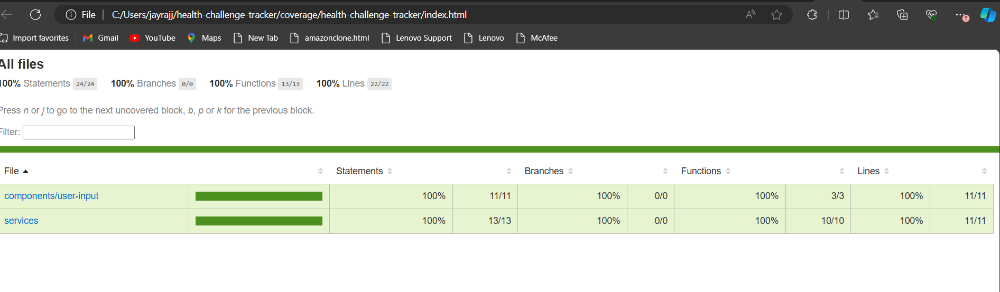
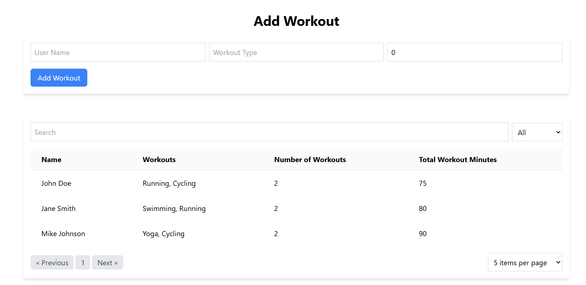
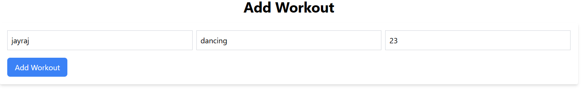
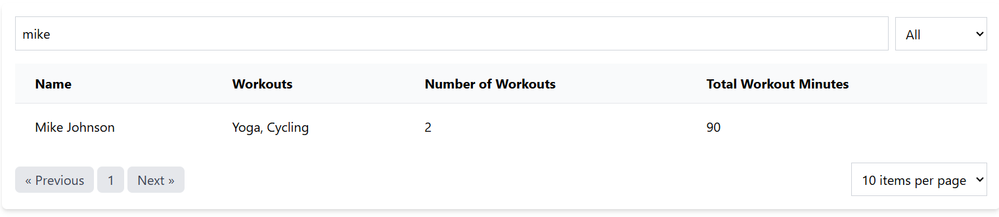

# Health Challenge Tracker

## Overview
This project is an Angular single-page application (SPA) for tracking user workouts. Users can add their workout details, filter workouts by type, and view summaries of their total workout time.

## Features
- Add user details including workout type and minutes
- Display users in a paginated table
- Filter users by name and workout type
- Persist data using `localStorage`
- Generate summary statistics for each user
- Unit tests with 100% code coverage for one component and one service
- Hosted on [Github Pages](https://jayraj175coder.github.io/HealthTrack/)

## Prerequisites
- Node.js
- Angular CLI

## Installation
1. Clone the repository:
    git clone https://github.com/yourusername/health-challenge-tracker.git
    cd health-challenge-tracker
   
2. Install dependencies:
    npm install
  

## Running the Application
To start the development server:
  ng serve

## Usage
- Adding a User
- Navigate to the "Add User" section.
- Fill in the user name, workout type, and workout minutes.
- Click "Add Workout" to save the details.
## Filtering Users
- Use the search bar to filter users by name.
- Use the dropdown menu to filter users by workout type.
## Viewing Summaries
- Navigate to the "Summary" section to view workout summaries for each user.

 ## Code Coverage

The project achieves 100% code coverage for both `UserInputComponent` and `UserService`. Below is the summary of the coverage report:

### Summary

| File                      | Statements | Branches | Functions | Lines |
|---------------------------|------------|----------|-----------|-------|
| user-input.component.ts   | 100%       | 100%     | 100%      | 100%  |
| user.service.ts           | 100%       | 100%     | 100%      | 100%  |
 

## Test cases
You can find the full code coverage report 

## Deployment
  (https://jayraj175coder.github.io/HealthTrack/)

## Screenshots
Home Page

Add User

User List

## author
jayraj Sanas

Thanks.